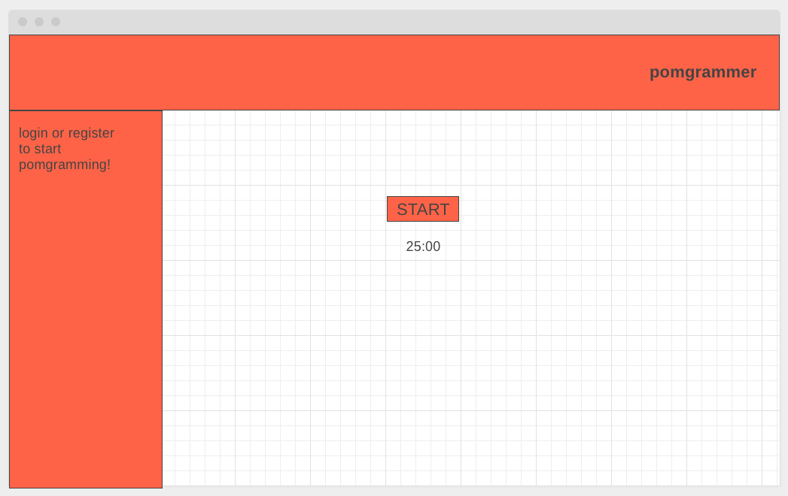
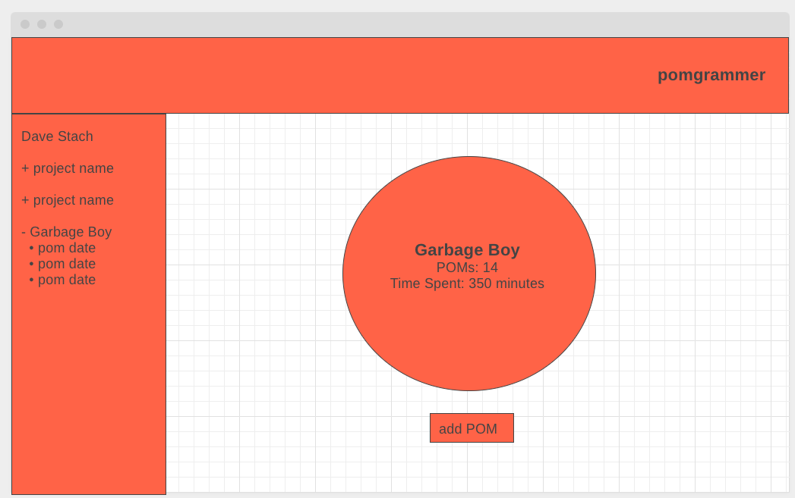
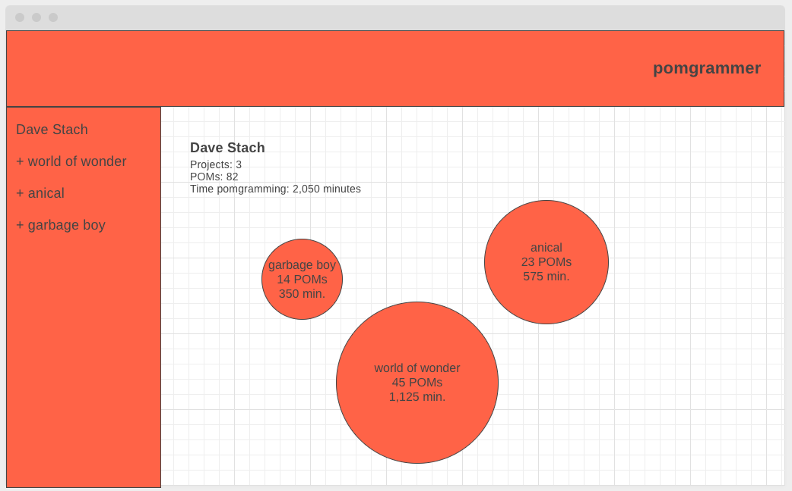
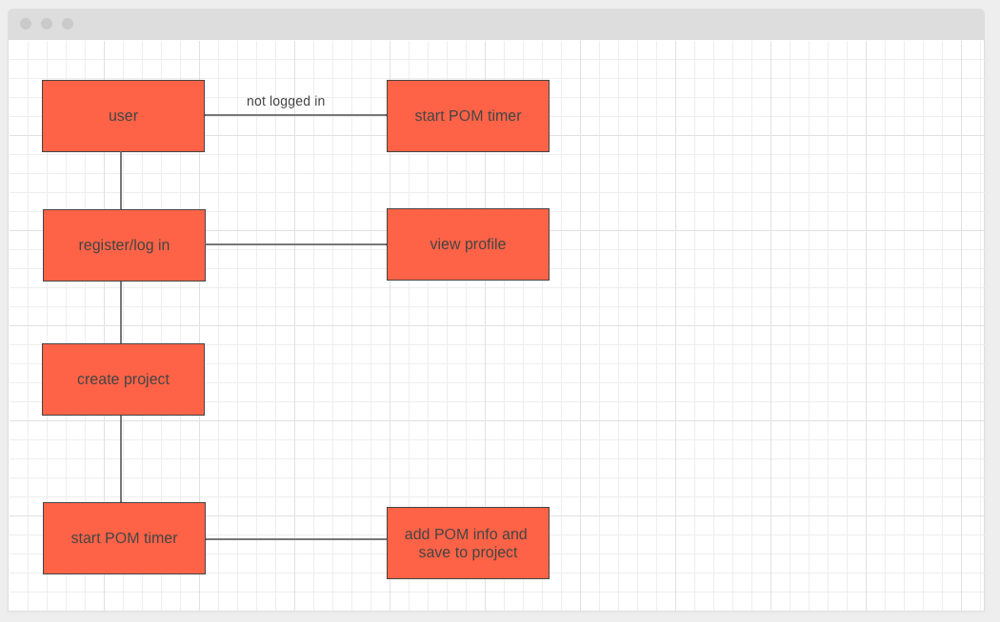

# pomgrammer
## Dave Stach

### Who?
I came up with the idea for pomgrammer drawing inspiration from my own obsessive tendancies. I love visualizing how I spend my time. The idea is that a user can log in and create a project that they are working on. They will name the project, add details like a description and github link and then start running a pomodoro timer. Once the time elapses the user will then add a note to the POM and save it to the according project. From there a user can view their profile that will, utilizing d3.js data viz, show a user their projects rendered in pomegranate inspired shapes varying in size by number of POMs within that project thus indicating how much time has been spent on each project. 

### Tech Stack
mongodb, express.js, next.js, node.js, d3.js

### New Tech Planning, Project Goals, Users and Roadblocks
1. To begin learning d3.js I plan to first read through the introduction documentation, then look at given examples and then look at the tutorials provided. 

2. pomgrammer is an app designed to help track and visualize a programmers time spent working on projects. Detailed user flow below. 

3. My app targets specifically programmers, but realistically any individual who works with a project-based work flow.

4. Potential Roadblocks
* Learning a new technology is going to be difficult, especially since I have not dealt with data visualization. 
* As this app is designed to track a users time over many projects, I will need to figure out how to demonstrate the functionality of the app before a user has inputted data. i.e. some sort of demo page to show the user the capabilities of the application. 

### [To-Do List](https://trello.com/b/ai49VMyx)
### 
### 
### 
### 
### 
