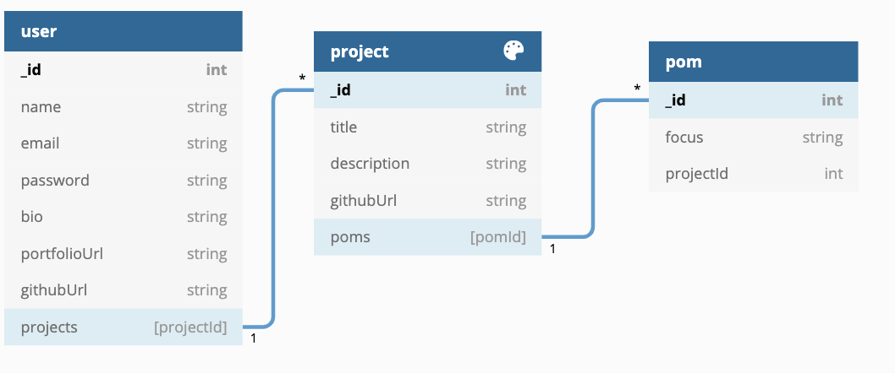

# Project 4
For your fourth project you will work, either on your own or in small teams, to build a proof of concept using a new techonology or library that we have not explored already in class. 

The intention of this project is that you either 1. try out a new technology you've been interested in using, but that we haven't used in class or 2. have an idea for a post cohort project which you can create an MVP of a feature for or an MVP for the project itself during the window of our P4.

When trying to scope your P4 think to how much you were able to accomplish during the hackathon, and keep your ideas to projects which include tasks that could fit that scope, plus some added features. 

*What does a non-passing P4 look like?*
- If you do not make a meaninful attempt at trying and implementing a new technology
- If you do not build anything substantial
- If you do not put in meaningful work/git commits all six days of the project (including the weekend)

## Ideas for Technologies to Use:
- Vue.js (frontend framework). 
- GraphQL (frontend querying language. Would recommend using with Hasura so that you don't have to take on Apollo and Prisma breaking change errors). 
- Unity (in C#)
- Integrating a Stripe frontend and backup to build a test level functional ecommmerce site
- D3.js (a data visualization javascript library)
- React-Bootstrap-Table or another React Table Library to create dynamic tables based on a database you create and seed

## Pitch Guidelines
Your P4 Project Pitches will be submitted via pull requets on this repo. *Fork and clone this repo. Make a new file in this repo called `[YOUR NAME]-p4-pitch.md`, Write your markdown in that file. Push up, and submit a pull request to the original repo to submit*. The instructional staff will review your submissions and add feedback/close pull requests. 

*Format for pitch markdown:*
* Name of app
* Your name/team members
* New tech you plan on using

Answer: 
1. How do you plan on learning/implementing this new technology?
2. What is your goal with this project?
3. Who is the user for your app?
4. Any potential roadblocks you think you might run into?

Include Graphics or Links to:
* Breakdown individual tasks and what you plan on working on day by day (in a Trello board or some other project planning tool/format). 
* Wireframes for app
* User flow for app

# pomgrammer
## Dave Stach

### Who?
I came up with the idea for pomgrammer drawing inspiration from my own obsessive tendancies. I love visualizing how I spend my time. The idea is that a user can log in and create a project that they are working on. They will name the project, add details like a description and github link and then start running a pomodoro timer. Once the time elapses the user will then add a note to the POM and save it to the according project. From there a user can view their profile that will, utilizing d3.js data viz, show a user their projects rendered in pomegranate inspired shapes varying in size by number of POMs within that project thus indicating how much time has been spent on each project. 

### Tech Stack
mongodb, express.js, next.js, d3.js

### New Tech Planning, Project Goals, Users and Roadblocks
1. To begin learning d3.js I plan to first read through the introduction documentation, then look at given examples and then look at the tutorials provided. 

2. pomgrammer is an app designed to help track and visualize a programmers time spent working on projects. Detailed user flow below. 

3. My app targets specifically programmers, but realistically any individual who works with a project-based work flow.

4. Potential Roadblocks
* Learning a new technology is going to be difficult, especially since I have not dealt with data visualization. 
* As this app is designed to track a users time over many projects, I will need to figure out how to demonstrate the functionality of the app before a user has inputted data. i.e. some sort of demo page to show the user the capabilities of the application. 

### [To-Do List](https://trello.com/b/ai49VMyx)
### 
### 
### 
### 
### 